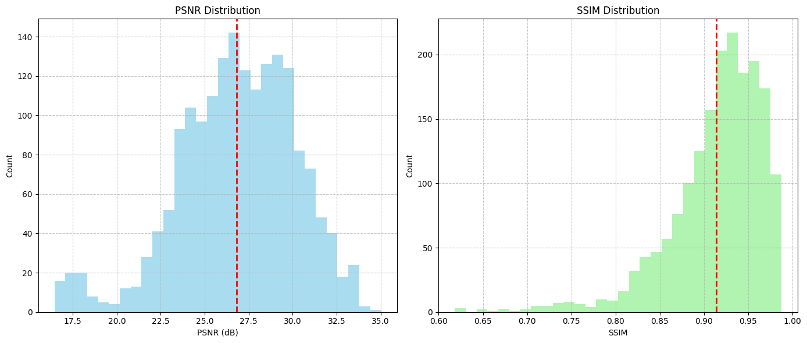

- # Low Light Image Deblurring

  ## 项目概述

  本项目包含两个低光饱和图像去模糊模型，专为LOLBlur数据集而设计：

  ### 原始模型 (Original Model)
  - **核心架构**：
    - **Retinex**分解分离反射率与光照
    - 密集注意力机制强化细节
    - 上下文门控优化信息流
  - **硬件效率**：
    - NVIDIA RTX 4090
    - 训练速度: 8 img/sec (batch=8, size=256)
    - 推理速度: 125.24 FPS
  
  ### 新模型 (Enhanced Model)
  - **架构优化**：
    - 引入**FAC(Feature Attention Convolution)**层
    - 增加Dropout正则化
    - 优化瓶颈层设计
  - **训练增强**：
    - 周期性测试集评估
    - 改进混合损失函数
    - 自适应学习率调度
  - **比较优势**：
    - 更好的去模糊效果
    - 减少过拟合
    - 更稳定的训练过程
  - **硬件效率**：
    - NVIDIA RTX 4090
    - 训练速度: 8 img/sec (batch=8, size=256)
    - 推理速度: 84.40 FPS
  
  **模型结构对比**：
  | 原始模型 | 新模型 |
  |----------|--------|
  |  |  |
  
  **数据集概况**：
  | 名称      | 链接                                                                 | 数量   | 描述                     |
  |-----------|----------------------------------------------------------------------|--------|--------------------------|
  | LOL-Blur  | [百度网盘](https://pan.baidu.com/s/1CPphxCKQJa_iJAGD6YACuA) (key: dz6u) | 12,000 | 170训练视频+30测试视频 |
  
  
  
    ## 性能对比（在LOLBlur的测试集上）
  
  | 指标        | 原始模型 | 新模型 | LEDNet(括号内为论文报告值) |
  | ----------- | -------- | ------ | :------------------- |
  | PSNR (dB)   | 23.65    | 23.88  | 26.06(25.74)   |
  | SSIM        | 0.744   | 0.750  | 0.852(0.850)  |
  | LPIPS (VGG) | 0.360   | 0.346 | 0.217(0.224)  |
  | 参数量 (M)  | 52.3     | 52.5   | 7.4             |
  
  
  
  ## 目录结构
  
  ```
  LowLightDeblur/
  ├── weights/                    # 模型权重
  │   ├── deblurnet_best.pth      # 原始模型
  │   └── deblurnet_fac_best.pth  # 新模型
  ├── checkpoint/                 # 训练检查点
  ├── fig/                        # 可视化结果
  ├── dataset/                    # 数据集
  │   ├── train/                  # 训练集 (10,200张)
  │   	├── high_sharp_scaled/  # 目标图片 
  │   	└── low_blur_noise/     # 输入图片 
  │   └── test/                   # 测试集 (1,800张)
  │   	├── high_sharp_scaled/  # 目标图片 
  │   	└── low_blur_noise/     # 输入图片 
  ├── result/                     # 结果目录
  │   ├── training_history_original.png    # 原始模型训练曲线
  │   ├── training_history_new.png         # 新模型训练曲线
  │   ├── test_results/           # 测试输出
  │   └── evaluation_results/     # 评估结果
  ├── test_images/                # 测试样例
  ├── deblur_unet_model.py        # 原始模型定义
  ├── new_unet_model.py           # 新模型定义
  ├── train_deblur_unet.py        # 原始模型训练
  ├── train_new_unet.py           # 新模型训练
  ├── test.py                     # 推理测试脚本
  ├── test.py                     # 推理测试脚本
  ├── calculate_iqa_pair.py		# LEDNet项目的模型评估脚本
  ├── generate_inference_dataset.py		 # 对数据集统一推理并保存结果图像，保持原始目录结构
  └── requirements.txt            # 依赖
  ```
  
  
  
  ## 环境配置
  
  python>=3.7
  
  torch>=1.8.0
  torchvision
  numpy
  pillow
  matplotlib
  tqdm
  lpips
  piq
  rawpy    
  
  ```bash
  pip install -r requirements.txt
  ```
  
  ## 训练指南
  
  ### 原始模型训练
  ```bash
  python train_deblur_unet.py \
    --data_dir dataset/train \
    --ckpt_dir checkpoint \
    --result_dir result
  ```
  
  ### 新模型训练
  ```bash
  python train_new_unet.py \
    --data_dir dataset/train \
    --test_dir dataset/test \
    --ckpt_dir new_checkpoint \
    --result_dir result \
    --test_interval 10  # 每10轮测试一次
  ```
  
  ## 测试与评估
  
  ### 单图或批量推理
  
  - 选择原始模型： --model_type = original，     --model_path = deblurnet_best.pth
  - 选择新模型：     --model_type = enhanced，--model_path = deblurnet_fac_best.pth
  - 是否保存对比图：  加入--save_comparison 保存
  
  ```bash
  # 单图推理，使用原始模型
  python test.py \
    --model_type original \
    --model_path weights/deblurnet_best.pth \
    --input_path test_images/0010.png \
    --output_dir result/test_results/original \
    --img_size 256 \
    --save_comparison 
    
  # 批量推理，使用新模型
  python test.py \
    --model_type enhanced \
    --model_path weights/deblurnet_fac_best.pth \
    --input_path test_images/ \
    --output_dir result/test_results/enhanced \
    --img_size 256 \
    --save_comparison
  ```
  
  
  
    ### 数据集评估
  
  ​		为确保评估的规范性，我们使用 **LEDNet** 项目提供的 **`calculate_iqa_pair.py`** 脚本进行图像质量测评。您可以按照以下步骤对模型输出结果进行标准化评估。
  
  ```
  # 第一步：生成测试集结果，保持数据集原始目录结构
  python generate_inference_dataset.py  --model_type enhanced  --model_path weights/deblurnet_fac_best.pth  --input_path dataset/test/low_blur_noise  --output_dir result/test_set_result/enhanced   --img_size 256
  
  # 第二步：使用 calculate_iqa_pair.py的评估脚本计算图像质量指标（PSNR、SSIM、LPIPS）
  python calculate_iqa_pair.py   --result_path result/test_set_result/enhanced  --gt_path dataset/test/high_sharp_scaled  --metrics psnr ssim lpips
  
  ```
  
  
  
  ## 结果可视化
  
  ### 训练过程
  | 原始模型                                                 | 新模型                                            |
  | -------------------------------------------------------- | ------------------------------------------------- |
  |  |  |
  
  ### 
  
  ### 指标分布（PSNR和SSIM直方图）
  | 原始模型                                           | 新模型                                          |
  | -------------------------------------------------- | ----------------------------------------------- |
  |  |  |
  
  
